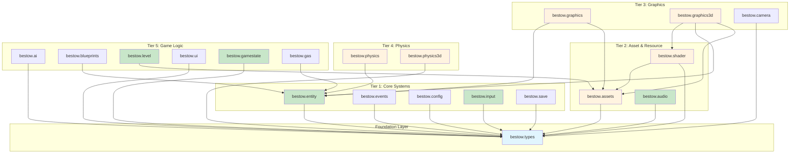

# Bestow Game Engine - Comprehensive Dependency Analysis

## Current Architecture Summary

The Bestow engine comprises 20 major systems organized in a layered architecture.

### Systems Identified

1. **bestow.types** - Core types (foundation, no dependencies)
2. **bestow.entity** - ECS system (depends: types)
3. **bestow.events** - Event dispatch (depends: types)
4. **bestow.config** - Configuration loader (depends: types)
5. **bestow.assets** - Asset management (depends: types)
6. **bestow.input** - Input handling (depends: types)
7. **bestow.audio** - Audio system (depends: types)
8. **bestow.graphics** - 2D rendering (depends: types, entity, assets)
9. **bestow.physics** - 2D physics (depends: types, entity)
10. **bestow.camera** - 2D camera control (depends: types)
11. **bestow.level** - Level/scene management (depends: types, assets)
12. **bestow.shader** - Dynamic shader system (depends: types, assets)
13. **bestow.graphics3d** - 3D rendering (depends: types, assets, entity, shader)
14. **bestow.physics3d** - 3D physics (depends: types)
15. **bestow.ai** - AI/pathfinding (depends: types)
16. **bestow.ui** - UI system (depends: types)
17. **bestow.blueprints** - Entity factories (depends: types, entity)
18. **bestow.gamestate** - Game state machine (depends: types)
19. **bestow.save** - Save/serialization (depends: types)
20. **bestow.gas** - Gameplay Ability System (depends: types, entity)

## Current Architecture Diagram



**Legend:**
- 🔵 Blue: Foundation
- 🟢 Green: User-Facing (Public API)
- 🟠 Orange: Background (Internal/Hidden)

## Ideal Architecture: Three-Layer Design

```
┌─────────────────────────────────────────────────────────────────┐
│                    PRESENTATION LAYER                            │
│                  (Game Developer Facing)                         │
│                                                                  │
│  ┌─────────┐  ┌─────────┐  ┌─────────┐  ┌─────────┐            │
│  │  World  │  │  Input  │  │  Audio  │  │  Game   │            │
│  │ (Entity │  │         │  │         │  │  State  │            │
│  │ Physics │  │         │  │         │  │         │            │
│  │ Render) │  │         │  │         │  │         │            │
│  └────┬────┘  └────┬────┘  └────┬────┘  └────┬────┘            │
│       │            │            │            │                  │
│  ┌────┴────┐  ┌────┴────┐  ┌────┴────┐  ┌────┴────┐            │
│  │  Level  │  │   AI    │  │   UI    │  │  Save   │            │
│  │         │  │         │  │         │  │         │            │
│  └─────────┘  └─────────┘  └─────────┘  └─────────┘            │
└─────────────────────────────────────────────────────────────────┘
                              │
                              ▼
┌─────────────────────────────────────────────────────────────────┐
│                   APPLICATION LAYER                              │
│                 (Internal Game Systems)                          │
│                                                                  │
│  ┌─────────────┐  ┌─────────────┐  ┌─────────────┐              │
│  │   Physics   │  │  Rendering  │  │   Camera    │              │
│  │  (2D/3D)    │  │   (2D/3D)   │  │             │              │
│  └─────────────┘  └─────────────┘  └─────────────┘              │
└─────────────────────────────────────────────────────────────────┘
                              │
                              ▼
┌─────────────────────────────────────────────────────────────────┐
│                  INFRASTRUCTURE LAYER                            │
│                   (Internal/Hidden)                              │
│                                                                  │
│  ┌─────────┐  ┌─────────┐  ┌─────────┐  ┌─────────┐            │
│  │ Assets  │  │ Shader  │  │ Events  │  │ Config  │            │
│  │         │  │         │  │         │  │         │            │
│  └─────────┘  └─────────┘  └─────────┘  └─────────┘            │
└─────────────────────────────────────────────────────────────────┘
```

## System Categorization Table

| System | Current Status | Proposed Status | Reason |
|--------|----------------|-----------------|--------|
| `bestow.types` | Foundation | Foundation | Core types - no change needed |
| `bestow.entity` | Public | **Public** (via World) | Game devs create/manage entities |
| `bestow.events` | Public | **Background** | Internal for system communication |
| `bestow.config` | Public | **Background** | Configuration only, loaded at init |
| `bestow.assets` | Public | **Background** | Should be hidden - accessed via facades |
| `bestow.input` | Public | **Public** | Game devs need input directly |
| `bestow.audio` | Public | **Public** (Simplified) | Simplified playback API |
| `bestow.graphics` | Public | **Background** | Part of rendering system |
| `bestow.graphics3d` | Public | **Background** | Part of rendering system |
| `bestow.physics` | Public | **Background** | Via entity components |
| `bestow.physics3d` | Public | **Background** | Via entity components |
| `bestow.camera` | Public | **Public** (via World) | Via World.setCamera() |
| `bestow.level` | Public | **Public** | Games load/manage levels |
| `bestow.shader` | Public | **Background** | Internal to graphics system |
| `bestow.ai` | Public | **Public** | AI/pathfinding is user-facing |
| `bestow.ui` | Public | **Public** | Games build UI systems |
| `bestow.blueprints` | Public | **Public** | Data-driven entity creation |
| `bestow.gamestate` | Public | **Public** | Core game loop management |
| `bestow.save` | Public | **Public** | Game saves/loads |
| `bestow.gas` | Public | **Public** | Gameplay abilities |

## Dependency Issues & Solutions

### Issue 1: Graphics → Entity Coupling
- **Current:** `graphics.renderEntities(IEntitySystem& entities)`
- **Problem:** Graphics knows about Entity internals
- **Solution:** World facade manages the render call internally

### Issue 2: Assets as Hub
- **Current:** Shader, Graphics3D, Level all import Assets
- **Problem:** Makes assets a critical bottleneck
- **Solution:** Systems receive assets via DI; users don't see it

### Issue 3: No Unified Entry Point
- **Current:** BestowEngine struct exposes all systems
- **Problem:** Overwhelming for new developers
- **Solution:** IEngine facade with minimal public API

### Issue 4: Graphics/Physics Redundancy
- **Current:** Separate 2D and 3D systems are both public
- **Problem:** Game must know which to use
- **Solution:** World facade delegates to appropriate implementation

## Minimal Public API

What game developers should interact with:

```cpp
import bestow.engine;

int main() {
    EngineSettings settings;
    settings.window.title = "My Game";
    settings.window.width = 1920;
    settings.window.height = 1080;

    auto engine = createEngine(settings);

    // What developers see:
    IWorld& world = engine->world();      // Entities + Physics + Rendering
    IInputSystem& input = engine->input();  // Input handling
    IAudio& audio = engine->audio();        // Simplified audio
    IGameStateSystem& states = engine->gameStates();  // State machine
    ILevelSystem& levels = engine->levels();  // Scene management
    ISettings& settings = engine->settings();  // Runtime config

    // Game loop
    while (engine->isRunning()) {
        float dt = engine->getDeltaTime();

        // Create entities
        Entity player = world.createEntity(Vec3{0, 0, 0});
        world.addComponent<Transform3D>(player, ...);
        world.addComponent<Mesh3DComponent>(player, ...);

        // Physics queries
        auto hit = world.raycast(origin, direction);

        // Audio
        audio.playSound("explosion.wav");

        // Input
        if (input.isActionActive("jump")) { ... }
    }
}
```

## What Should Be Hidden

| Hidden System | Why Hidden | How Users Access It |
|--------------|-----------|---------------------|
| Assets | Internal loading | Via blueprint paths, audio paths |
| Graphics/Graphics3D | Internal rendering | Automatic via entity components |
| Physics/Physics3D | Internal simulation | Via World.raycast(), physics components |
| Shader | Internal shader management | Via material Lua files |
| Events | Internal message bus | Custom game events via events() |
| Config | Init-time only | Via EngineSettings |

## Summary Statistics

| Category | Count | Examples |
|----------|-------|----------|
| **Public APIs** | 8 | World, Input, Audio, GameState, Level, AI, UI, Save |
| **Background Systems** | 9 | Graphics, Graphics3D, Physics, Physics3D, Shader, Assets, Events, Config, Camera |
| **Foundation** | 1 | Types |
| **Specialized** | 2 | GAS, Blueprints |
| **Total** | **20** | - |

## Implementation: Fruit DI Integration

The new architecture uses Fruit dependency injection to wire systems:

```cpp
// Background systems are injected as dependencies
fruit::Component<IEngine> getEngineComponent() {
    return fruit::createComponent()
        // Background systems (users don't see these)
        .install(getAssetSystemComponent)
        .install(getShaderSystemComponent)
        .install(getGraphics3DSystemComponent)
        .install(getPhysics3DSystemComponent)

        // User-facing systems
        .install(getEntitySystemComponent)
        .install(getInputSystemComponent)
        .install(getAudioSystemComponent)
        .install(getGameStateSystemComponent)
        .install(getLevelSystemComponent)

        // Wire everything to Engine facade
        .bind<IEngine, EngineImpl>();
}
```

This reduces the learning curve from "know 20 systems" to "know 8 public interfaces".
