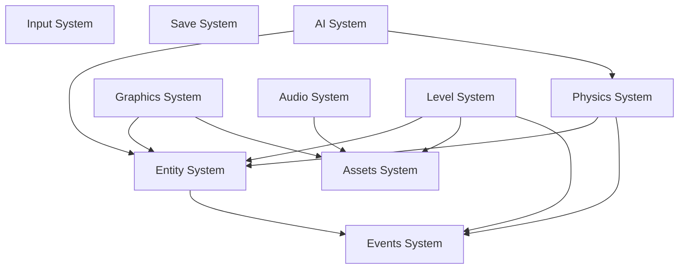

# Bestow Technical Design

> **Last Updated:** 2025-11-26
> **Status:** Living Document
> **Purpose:** Comprehensive architecture and design reference for Bestow game framework

---

## Table of Contents

1. [Overview](#overview)
2. [Architecture Principles](#architecture-principles)
3. [System Architecture](#system-architecture)
4. [Lua Data Architecture](#lua-data-architecture)
5. [Module System](#module-system)
6. [Core Systems](#core-systems)
7. [Data Formats](#data-formats)
8. [Performance Considerations](#performance-considerations)
9. [Development Workflow](#development-workflow)

---

## Overview

Bestow is a modern C++23 game framework built on interface-driven architecture, ECS (Entity Component System), and data-driven design. It emphasizes:

- **Modern C++23** - Leverages latest language features (modules, `std::expected`, ranges)
- **Program to Interfaces** - All systems implement abstract interfaces for testability
- **Composition Over Inheritance** - ECS architecture with EnTT library
- **Data-Driven Design** - Game content defined in Lua, configuration in JSON/Lua
- **Hot Reload** - Change game content without recompiling C++

### Key Technologies

| Technology | Version | Purpose |
|------------|---------|---------|
| C++23 | - | Core language with modules |
| LLVM Clang | 20+ | Compiler with `import std;` support |
| CMake | 3.28+ | Build system with module support |
| EnTT | 3.12+ | Entity Component System |
| Box2D | 3.1+ | 2D Physics |
| GLFW | 3.3+ | Windowing |
| OpenGL | 4.1+ | Rendering |
| FMOD Core | 2.02+ | Audio |
| Lua | 5.4+ | Scripting |
| sol2 | 3.3+ | Lua C++ bindings |

---

## Architecture Principles

### 1. Dependency Inversion

All systems depend on abstract interfaces, not concrete implementations:

```cpp
// Interface (in bestow-contract)
export class IEntitySystem {
public:
    virtual ~IEntitySystem() = default;
    virtual Entity createEntity() = 0;
    virtual void destroyEntity(Entity e) = 0;
    // ...
};

// Implementation (in bestow-entity)
class EntitySystemImpl : public IEntitySystem {
    // Concrete implementation using EnTT
};

// Factory function
export std::unique_ptr<IEntitySystem> createEntitySystem();
```

### 2. Data-Driven by Default

Game content lives in Lua files, not C++ code:

```cpp
// BAD: Hardcoded in C++
Entity createPlayer() {
    auto e = entities->createEntity();
    entities->emplace<Transform>(e, Vec2{100, 200});
    entities->emplace<Health>(e, 100);
    return e;
}

// GOOD: Defined in Lua blueprint
// blueprints/player.lua
return {
    transform = { x = 100, y = 200 },
    health = { current = 100, max = 100 },
    sprite = sprite("player.png", animations)
}
```

### 3. Compile-Time Safety

Use strong types and `std::expected` for error handling:

```cpp
// Strong entity type (not just uint32_t)
export using Entity = entt::entity;

// Error handling without exceptions
export template<typename T, typename E = std::error_code>
using Result = std::expected<T, E>;

Result<Entity, EntityError> createPlayerEntity();
```

### 4. Hot Reload First

Design for live editing:

- Lua files watched for changes
- Blueprints re-executed on save
- Levels reloaded without losing editor state
- Assets reloaded on file modification

---

## System Architecture

### System Hierarchy

```
┌─────────────────────────────────────────────────┐
│                  Application                    │
│            (Game-specific logic)                │
└─────────────────────────────────────────────────┘
                       │
                       ▼
┌─────────────────────────────────────────────────┐
│                 Bestow Core                     │
│    (System orchestration, main loop, DI)        │
└─────────────────────────────────────────────────┘
                       │
        ┌──────────────┼──────────────┐
        ▼              ▼              ▼
┌──────────────┐ ┌──────────┐ ┌──────────────┐
│   Gameplay   │ │ Content  │ │ Infrastructure│
│   Systems    │ │ Systems  │ │   Systems     │
└──────────────┘ └──────────┘ └──────────────┘
│ Entity       │ │ Graphics │ │ Events        │
│ Physics      │ │ Audio    │ │ Input         │
│ AI           │ │ Assets   │ │ Save          │
│ Level        │ │          │ │               │
└──────────────┘ └──────────┘ └──────────────┘
```

### System Dependencies



**Dependency Tiers:**

- **Tier 0:** Events (no dependencies)
- **Tier 1:** Entity, Input, Save (depend only on Events)
- **Tier 2:** Physics, Graphics, Audio, Assets (depend on Tier 0-1)
- **Tier 3:** Level, AI (depend on Tier 0-2)
- **Tier 4:** Core, Dev Tools (depend on all systems)

---

## Lua Data Architecture

### Philosophy: Traits + Prototypes Hybrid

Bestow uses a hybrid approach combining:

1. **Traits** - Small, reusable functions that return component data
2. **Blueprints** - Entity templates that compose traits
3. **Prototype Inheritance** - `P.extend()` for entity variants
4. **Configuration** - Game-wide settings split by concern
5. **Levels** - Entity spawning by blueprint reference

This design maximizes:
- **Reusability** - Traits are used across many blueprints
- **Maintainability** - Changes to traits affect all users
- **Hot Reload** - Modify any Lua file without recompiling
- **Minimal C++** - Game logic lives in Lua, C++ provides systems

### Folder Structure

```
data/
├── traits/                    # Reusable building blocks
│   ├── physics_body.lua       # Physics component factory
│   ├── animated_sprite.lua    # Sprite animation factory
│   ├── health.lua             # Health component factory
│   ├── patrol_behavior.lua    # AI patrol factory
│   ├── collectible.lua        # Collectible item factory
│   └── ...                    # More trait functions
│
├── blueprints/                # Entity compositions
│   ├── _base.lua              # Provides P.extend() inheritance
│   ├── player.lua             # Player entity blueprint
│   ├── enemies/
│   │   ├── base.lua           # Common enemy traits
│   │   ├── slime.lua          # Extends enemies/base
│   │   ├── flying.lua         # Extends enemies/base
│   │   └── boss.lua           # Extends enemies/base
│   └── items/
│       ├── coin.lua           # Simple collectible
│       ├── powerup.lua        # Player powerup
│       └── chest.lua          # Interactive container
│
├── config/                    # Global settings (split by concern)
│   ├── game.lua               # Game-wide settings
│   ├── physics.lua            # Physics constants
│   ├── input.lua              # Key bindings
│   └── audio.lua              # Volume levels, channel setup
│
└── levels/
    ├── level1.lua             # First level layout
    ├── level2.lua             # Second level layout
    └── helpers/               # Level generation utilities
        ├── patterns.lua       # Entity placement patterns
        └── geometry.lua       # Shape helpers (grid, arc, wave)
```

### 1. Traits - Component Factories

Traits are small Lua functions that return component data. They encapsulate component defaults and parameter validation.

**Example: `traits/physics_body.lua`**

```lua
-- Returns a physics body component configuration
return function(opts)
    return {
        type = opts.type or "dynamic",
        width = opts.width or 32,
        height = opts.height or 32,
        fixedRotation = opts.fixedRotation ~= false,
        density = opts.density or 1.0,
        friction = opts.friction or 0.3,
        restitution = opts.restitution or 0.0
    }
end
```

**Example: `traits/animated_sprite.lua`**

```lua
-- Returns an animated sprite component
return function(texturePath, animations)
    return {
        texture = texturePath,
        animations = animations,
        currentAnim = "idle",
        frameIndex = 0,
        frameTimer = 0.0,
        fps = 12
    }
end
```

**Example: `traits/health.lua`**

```lua
-- Returns a health component with current/max
return function(maxHealth)
    return {
        current = maxHealth,
        max = maxHealth,
        invulnerable = false
    }
end
```

**Example: `traits/patrol_behavior.lua`**

```lua
-- Returns an AI patrol behavior
return function(range, speed)
    return {
        range = range,
        speed = speed,
        startX = 0,  -- Set at spawn time
        direction = 1,
        state = "patrolling"
    }
end
```

**Example: `traits/collectible.lua`**

```lua
-- Returns a collectible item configuration
return function(itemType, value)
    return {
        type = itemType,
        value = value,
        collected = false,
        effect = nil  -- Optional effect function
    }
end
```

### 2. Blueprints - Entity Templates

Blueprints compose traits to define complete entities. They return a table of components.

**Example: `blueprints/player.lua`**

```lua
local physics = require("traits/physics_body")
local sprite = require("traits/animated_sprite")
local health = require("traits/health")

return {
    physics = physics({
        type = "dynamic",
        width = 32,
        height = 48,
        fixedRotation = true
    }),

    sprite = sprite("player.png", {
        idle = {0, 3},
        run = {4, 9},
        jump = {10, 10},
        fall = {11, 11},
        attack = {12, 15}
    }),

    health = health(100),

    controller = {
        speed = 200,
        jumpForce = 400,
        groundAccel = 800,
        airAccel = 200,
        maxFallSpeed = 600
    },

    attack = {
        damage = 25,
        range = 50,
        cooldown = 0.5,
        currentCooldown = 0.0
    }
}
```

**Example: `blueprints/enemies/base.lua`**

```lua
local physics = require("traits/physics_body")
local sprite = require("traits/animated_sprite")
local health = require("traits/health")

-- Base enemy blueprint - all enemies extend this
return {
    physics = physics({
        type = "dynamic",
        width = 32,
        height = 32,
        fixedRotation = true
    }),

    sprite = sprite("enemy.png", {
        idle = {0, 1},
        move = {2, 5},
        attack = {6, 8},
        death = {9, 12}
    }),

    health = health(50),

    enemy = {
        damage = 10,
        score = 100,
        aiState = "idle"
    }
}
```

### 3. Prototype Inheritance - P.extend()

The `P.extend()` function enables blueprint inheritance. It's defined in `blueprints/_base.lua` and allows child blueprints to override specific components.

**Example: `blueprints/_base.lua`**

```lua
-- Prototype inheritance system
local P = {}

-- Deep copy table
local function deepCopy(original)
    if type(original) ~= 'table' then
        return original
    end
    local copy = {}
    for k, v in pairs(original) do
        copy[k] = deepCopy(v)
    end
    return copy
end

-- Merge child into parent (child wins conflicts)
local function merge(parent, child)
    local result = deepCopy(parent)
    for k, v in pairs(child) do
        if type(v) == 'table' and type(result[k]) == 'table' then
            result[k] = merge(result[k], v)
        else
            result[k] = v
        end
    end
    return result
end

-- Extend a parent blueprint
function P.extend(parentPath, overrides)
    local parent = require(parentPath)
    return merge(parent, overrides)
end

return P
```

**Example: `blueprints/enemies/slime.lua`**

```lua
local sprite = require("traits/animated_sprite")
local patrol = require("traits/patrol_behavior")

return P.extend("blueprints/enemies/base", {
    -- Override sprite to use slime texture
    sprite = sprite("slime.png", {
        idle = {0, 1},
        move = {2, 5},
        attack = {6, 7},
        death = {8, 11}
    }),

    -- Add patrol behavior
    patrol = patrol(100, 30),  -- range=100, speed=30

    -- Override health to be weaker
    health = { current = 30, max = 30 },

    -- Override enemy properties
    enemy = {
        damage = 5,
        score = 50,
        aiState = "patrolling"
    }
})
```

**Example: `blueprints/enemies/flying.lua`**

```lua
local sprite = require("traits/animated_sprite")

return P.extend("blueprints/enemies/base", {
    physics = {
        type = "kinematic",  -- Flying enemies ignore gravity
        width = 40,
        height = 32,
        fixedRotation = true
    },

    sprite = sprite("bat.png", {
        fly = {0, 3},
        dive = {4, 7},
        death = {8, 11}
    }),

    flying = {
        hoverHeight = 200,
        diveSpeed = 300,
        returnSpeed = 100,
        state = "hovering"
    },

    enemy = {
        damage = 15,
        score = 150,
        aiState = "flying"
    }
})
```

**Example: `blueprints/items/coin.lua`**

```lua
local physics = require("traits/physics_body")
local sprite = require("traits/animated_sprite")
local collectible = require("traits/collectible")

return {
    physics = physics({
        type = "static",  -- Coins don't move
        width = 16,
        height = 16,
        isSensor = true  -- Trigger only, no collision
    }),

    sprite = sprite("coin.png", {
        idle = {0, 7}  -- Spinning animation
    }),

    collectible = collectible("coin", 10)  -- Type and value
}
```

### 4. Configuration - Global Settings

Configuration files define game-wide settings, split by domain.

**Example: `config/game.lua`**

```lua
return {
    title = "Platformer Demo",
    resolution = { width = 1280, height = 720 },
    targetFPS = 60,
    vsync = true,
    fullscreen = false,

    debug = {
        showFPS = true,
        showColliders = false,
        godMode = false
    }
}
```

**Example: `config/physics.lua`**

```lua
return {
    gravity = { x = 0, y = -980 },  -- Pixels per second squared
    timeStep = 1.0 / 60.0,
    velocityIterations = 8,
    positionIterations = 3,

    layers = {
        player = 1,
        enemy = 2,
        terrain = 4,
        projectile = 8,
        pickup = 16
    },

    collisionMatrix = {
        player = {"terrain", "enemy", "pickup"},
        enemy = {"terrain", "player", "projectile"},
        terrain = {"player", "enemy", "projectile"},
        projectile = {"terrain", "enemy"},
        pickup = {"player"}
    }
}
```

**Example: `config/input.lua`**

```lua
return {
    keyboard = {
        moveLeft = "A",
        moveRight = "D",
        jump = "Space",
        attack = "J",
        interact = "E",
        pause = "Escape"
    },

    gamepad = {
        moveX = "LeftStickX",
        moveY = "LeftStickY",
        jump = "A",
        attack = "X",
        interact = "B",
        pause = "Start"
    }
}
```

**Example: `config/audio.lua`**

```lua
return {
    masterVolume = 0.8,

    channels = {
        music = { volume = 0.7, maxInstances = 1 },
        sfx = { volume = 1.0, maxInstances = 16 },
        ui = { volume = 0.9, maxInstances = 4 },
        ambient = { volume = 0.6, maxInstances = 8 }
    },

    -- Distance attenuation for 3D sounds
    minDistance = 50,
    maxDistance = 500
}
```

### 5. Levels - Entity Spawning

Levels reference blueprints by name and specify spawn positions/properties.

**Example: `levels/level1.lua`**

```lua
return {
    name = "The Beginning",
    backgroundColor = {0.4, 0.6, 0.9, 1.0},

    -- Static environment
    terrain = {
        -- Ground platform
        { x = 0, y = -50, width = 2000, height = 100 },
        -- Floating platforms
        { x = 300, y = 100, width = 200, height = 20 },
        { x = 600, y = 200, width = 200, height = 20 }
    },

    -- Entity spawns
    entities = {
        -- Player spawn
        { blueprint = "player", x = 100, y = 200 },

        -- Enemies
        { blueprint = "enemies/slime", x = 400, y = 200 },
        { blueprint = "enemies/slime", x = 500, y = 200 },
        { blueprint = "enemies/flying", x = 800, y = 300 },

        -- Collectibles
        { blueprint = "items/coin", x = 300, y = 150 },
        { blueprint = "items/coin", x = 350, y = 150 },
        { blueprint = "items/coin", x = 400, y = 150 },
        { blueprint = "items/powerup", x = 700, y = 250, powerType = "double_jump" }
    },

    -- Spawn points for respawn/checkpoints
    spawnPoints = {
        start = { x = 100, y = 200 },
        checkpoint1 = { x = 600, y = 250 }
    },

    -- Trigger regions
    regions = {
        {
            name = "checkpoint1",
            x = 600, y = 200, width = 100, height = 200,
            onEnter = "activateCheckpoint1"
        },
        {
            name = "exit",
            x = 1800, y = 0, width = 100, height = 400,
            onEnter = "loadNextLevel"
        }
    }
}
```

**Example: Using level helpers for patterns**

`levels/helpers/patterns.lua`:

```lua
local P = {}

-- Spawn entities in a grid
function P.grid(blueprint, startX, startY, cols, rows, spacingX, spacingY)
    local entities = {}
    for row = 0, rows - 1 do
        for col = 0, cols - 1 do
            table.insert(entities, {
                blueprint = blueprint,
                x = startX + col * spacingX,
                y = startY + row * spacingY
            })
        end
    end
    return entities
end

-- Spawn entities in a wave pattern
function P.wave(blueprint, startX, startY, count, spacing, amplitude, frequency)
    local entities = {}
    for i = 0, count - 1 do
        local x = startX + i * spacing
        local y = startY + math.sin(i * frequency) * amplitude
        table.insert(entities, { blueprint = blueprint, x = x, y = y })
    end
    return entities
end

-- Spawn entities in an arc
function P.arc(blueprint, centerX, centerY, radius, startAngle, endAngle, count)
    local entities = {}
    local angleStep = (endAngle - startAngle) / (count - 1)
    for i = 0, count - 1 do
        local angle = startAngle + i * angleStep
        local x = centerX + math.cos(angle) * radius
        local y = centerY + math.sin(angle) * radius
        table.insert(entities, { blueprint = blueprint, x = x, y = y })
    end
    return entities
end

return P
```

`levels/level2.lua`:

```lua
local patterns = require("levels/helpers/patterns")

local entities = {}

-- Add player
table.insert(entities, { blueprint = "player", x = 100, y = 200 })

-- Add grid of coins
for _, coin in ipairs(patterns.grid("items/coin", 300, 100, 10, 3, 50, 50)) do
    table.insert(entities, coin)
end

-- Add wave of flying enemies
for _, enemy in ipairs(patterns.wave("enemies/flying", 500, 300, 8, 100, 50, 0.5)) do
    table.insert(entities, enemy)
end

return {
    name = "The Gauntlet",
    entities = entities
}
```

### C++ Integration

The C++ level system loads and executes Lua files using sol2:

```cpp
// bestow-level/src/LevelSystem.cpp

class LevelSystemImpl : public ILevelSystem {
public:
    Result<LevelHandle> loadLevel(std::string_view levelPath) override {
        sol::state lua;

        // Sandbox Lua environment
        sandboxLua(lua);

        // Load level file
        auto result = lua.script_file(std::string(levelPath));
        if (!result.valid()) {
            return std::unexpected(LevelError::LuaScriptError);
        }

        sol::table level = result;

        // Extract level metadata
        std::string name = level["name"].get_or<std::string>("Unnamed");

        // Spawn entities
        sol::table entities = level["entities"];
        for (size_t i = 1; i <= entities.size(); ++i) {
            sol::table entityDef = entities[i];
            std::string blueprint = entityDef["blueprint"];
            float x = entityDef["x"];
            float y = entityDef["y"];

            // Create entity from blueprint
            Entity e = spawnFromBlueprint(blueprint, x, y);

            // Apply any per-instance overrides
            applyOverrides(e, entityDef);
        }

        return LevelHandle{generateHandle()};
    }

private:
    void sandboxLua(sol::state& lua) {
        lua.open_libraries(sol::lib::base, sol::lib::math, sol::lib::table);

        // Remove dangerous functions
        lua["os"] = sol::nil;
        lua["io"] = sol::nil;
        lua["loadfile"] = sol::nil;
        lua["dofile"] = sol::nil;
        lua["load"] = sol::nil;
    }

    Entity spawnFromBlueprint(const std::string& blueprintPath, float x, float y) {
        // Load blueprint (cached)
        auto blueprint = blueprintCache_.get(blueprintPath);
        if (!blueprint) {
            blueprint = loadBlueprint(blueprintPath);
            blueprintCache_.insert(blueprintPath, blueprint);
        }

        // Create entity
        Entity e = entitySystem_->createEntity();

        // Apply components from blueprint
        for (auto& [componentName, componentData] : blueprint->components) {
            createComponentFromLua(e, componentName, componentData);
        }

        // Set transform
        if (auto* transform = entitySystem_->tryGet<Transform>(e)) {
            transform->position = {x, y};
        }

        return e;
    }
};
```

### Hot Reload Implementation

The hot reload system watches Lua files and re-executes them on change:

```cpp
// bestow-dev/src/HotReloadManager.cpp

void HotReloadManager::onFileChanged(const std::string& path) {
    if (path.ends_with(".lua")) {
        if (path.contains("blueprints/")) {
            reloadBlueprint(path);
        } else if (path.contains("levels/")) {
            reloadLevel(path);
        } else if (path.contains("config/")) {
            reloadConfig(path);
        }
    }
}

void HotReloadManager::reloadBlueprint(const std::string& path) {
    // Clear cached blueprint
    blueprintCache_.remove(path);

    // Find all entities using this blueprint
    auto entities = findEntitiesWithBlueprint(path);

    // Reload blueprint
    auto newBlueprint = loadBlueprint(path);

    // Update existing entities
    for (Entity e : entities) {
        updateEntityFromBlueprint(e, newBlueprint);
    }

    log("Hot reload: Blueprint '{}' updated ({} entities affected)", path, entities.size());
}
```

### Benefits of This Architecture

1. **Reusability**
   - Traits are shared across many blueprints
   - Change `traits/health.lua` affects all users
   - No code duplication

2. **Inheritance Without Complexity**
   - `P.extend()` provides simple inheritance
   - Override only what's different
   - No complex class hierarchies

3. **Separation of Concerns**
   - Traits = Component factories
   - Blueprints = Entity templates
   - Levels = Spawning/placement
   - Config = Global settings

4. **Hot Reload at Every Level**
   - Edit traits → All blueprints update
   - Edit blueprints → Existing entities update
   - Edit levels → Level reloads
   - No C++ recompilation

5. **Minimal C++ Code**
   - C++ provides systems (physics, rendering, etc.)
   - Lua defines game content
   - Clear separation of engine vs. game

6. **Designer-Friendly**
   - Lua is approachable (Python-like syntax)
   - Comments allowed
   - Trailing commas OK
   - Variables and functions for DRY

---

## Module System

### C++23 Modules

Bestow uses C++23 modules with `import std;` for standard library access.

**Module naming convention:**

```
bestow.types          // Core types and aliases
bestow.entity         // Entity system interface
bestow.graphics       // Graphics system interface
bestow.audio          // Audio system interface
bestow.input          // Input system interface
bestow.assets         // Asset system interface
bestow.save           // Save system interface
bestow.level          // Level system interface
bestow.events         // Event system interface
bestow.physics        // Physics system interface
bestow.ai             // AI system interface
bestow                // Primary module (re-exports all)
```

**File extensions:**

| Compiler | Interface Unit | Implementation Unit |
|----------|----------------|---------------------|
| Clang | `.cppm` | `.cpp` |
| MSVC | `.ixx` | `.cpp` |
| GCC | `.cppm` | `.cpp` |

**Module structure pattern:**

```cpp
// bestow-entity/src/bestow.entity.cppm (Interface)
module;

// Global module fragment - third-party includes only
#include <entt/entt.hpp>

export module bestow.entity;

import std;
import bestow.types;

export namespace bestow {

class IEntitySystem {
public:
    virtual ~IEntitySystem() = default;
    virtual Entity createEntity() = 0;
    // ...
};

}
```

```cpp
// bestow-entity/src/bestow.entity.impl.cppm (Implementation Interface)
module;

#include <entt/entt.hpp>

export module bestow.entity.impl;

import std;
import bestow.entity;
import bestow.types;

export namespace bestow {

class EntitySystemImpl : public IEntitySystem {
    // Concrete implementation
};

std::unique_ptr<IEntitySystem> createEntitySystem();

}
```

```cpp
// bestow-entity/src/EntitySystem.cpp (Implementation)
module bestow.entity.impl;

import std;
import bestow.entity;

namespace bestow {

Entity EntitySystemImpl::createEntity() {
    return registry_.create();
}

std::unique_ptr<IEntitySystem> createEntitySystem() {
    return std::make_unique<EntitySystemImpl>();
}

}
```

### Import Patterns

```cpp
// Game code imports only what it needs
import bestow;              // Everything
import bestow.entity;       // Just entity system
import bestow.graphics;     // Just graphics system

#ifdef BESTOW_DEV_TOOLS
import bestow.dev;          // Dev tools (debug only)
#endif
```

---

## Core Systems

### Entity System

**Technology:** EnTT 3.12+

**Responsibilities:**
- Entity creation/destruction
- Component attachment/removal
- View iteration
- Entity lifecycle management

**Key Types:**

```cpp
using Entity = entt::entity;

template<typename... Components>
class IEntitySystem {
    virtual Entity createEntity() = 0;
    virtual void destroyEntity(Entity e) = 0;

    template<typename T, typename... Args>
    T& emplace(Entity e, Args&&... args);

    template<typename T>
    T* tryGet(Entity e);

    template<typename... T>
    auto view();
};
```

### Physics System

**Technology:** Box2D 3.1

**Responsibilities:**
- 2D rigid body simulation
- Collision detection/response
- Spatial queries (AABB, circle, raycast)
- Sensor/trigger support

**Key Features:**
- Fixed timestep (1/60s)
- Collision filtering by layer/mask
- Contact callbacks via event system
- Body-entity mapping

### Graphics System

**Technology:** OpenGL 4.1 Core, GLFW, glad

**Responsibilities:**
- Window management
- Sprite rendering with batching
- Text rendering (MSDF fonts)
- Debug primitives
- Camera/viewport

**Rendering Pipeline:**
1. Collect draw calls
2. Sort by layer + texture
3. Batch identical materials
4. Submit to GPU

### Audio System

**Technology:** FMOD Core API

**Responsibilities:**
- Music/SFX playback
- 3D positional audio
- Channel management
- Volume groups

**Channel Architecture:**
- Fixed channels for music/UI (looping)
- Dynamic channels for SFX (one-shot)
- Positional sounds (3D attenuation)

### Asset System

**Technology:** stb_image, FMOD, FreeType

**Responsibilities:**
- Asset loading (textures, sounds, fonts, data)
- Async loading with taskflow
- Asset caching and lifetime management
- Hot reload support

**Asset Types:**

| Type | Loader | Format |
|------|--------|--------|
| Texture | stb_image | PNG, JPG, TGA |
| Sound | FMOD | WAV, OGG, MP3 |
| Font | FreeType + MSDF | TTF |
| Data | nlohmann_json | JSON |

### Input System

**Technology:** GLFW (keyboard/mouse), SDL2 (controllers)

**Responsibilities:**
- Keyboard/mouse input polling
- Controller enumeration and hot-plug
- Action mapping with modifiers
- Input listening for rebinding

**Action Mapping:**

```cpp
ActionMapping mapping{
    .action = "jump",
    .device = InputDevice::Keyboard,
    .input = "Space"
};
input->registerActionMapping(mapping);

if (input->isActionPressed("jump")) {
    // ...
}
```

### Save System

**Technology:** cereal (binary serialization), nlohmann_json (metadata)

**Responsibilities:**
- Save/load game state
- Profile management
- Auto-save scheduling
- Version migration (future)

**File Format:**

```
save_0.sav:
- Magic: 0x4A465356 ("JFSV")
- Version: uint32
- Saveable data (cereal binary)

save_0.meta:
{
  "slot": 0,
  "saveName": "...",
  "timestamp": 1732568400,
  "playtimeSeconds": 3600
}
```

### Level System

**Technology:** Lua 5.4, sol2

**Responsibilities:**
- Level file loading (Lua execution)
- Entity spawning from blueprints
- Spawn point/region extraction
- Level transitions
- Hot reload

### AI System

**Technology:** BehaviorTree.CPP, Recast/Detour

**Responsibilities:**
- Behavior tree execution
- Blackboard data storage
- Navigation mesh queries
- Pathfinding
- Steering behaviors

### Event System

**Responsibilities:**
- Immediate event dispatch
- Deferred event queue
- Type-safe subscriptions
- Thread-safe queue

**Usage:**

```cpp
// Subscribe
auto id = events->subscribe(Events::Collision, [](const EventData& data) {
    auto& collision = std::get<CollisionEvent>(data);
    // Handle collision
});

// Publish (immediate)
events->publish(Events::PlayerDeath, PlayerDeathEvent{playerEntity});

// Enqueue (deferred)
events->enqueue(Events::LevelComplete, LevelCompleteEvent{levelId});

// Process queue (once per frame)
events->processQueue();

// Unsubscribe
events->unsubscribe(id);
```

---

## Data Formats

### Summary Table

| Data Type | Format | Location | Reason |
|-----------|--------|----------|--------|
| Entity Blueprints | Lua | `data/blueprints/` | Inheritance, trait composition, hot reload |
| Traits | Lua | `data/traits/` | Reusable component factories |
| Levels | Lua | `data/levels/` | Loops, patterns, functions, hot reload |
| Game Config | Lua | `data/config/` | Variables, computed values, hot reload |
| User Settings | JSON | `saves/settings.json` | Simple key-value, runtime-saved |
| Save Files | Binary (cereal) | `saves/*/save_*.sav` | Fast, compact, versioned |
| Save Metadata | JSON | `saves/*/save_*.meta` | Human-readable save info |

### Why Lua Instead of JSON?

Lua provides crucial advantages for game data:

1. **Comments** - `-- This is a comment`
2. **Trailing Commas** - No syntax errors
3. **Variables** - `local GROUND_Y = 100`
4. **Functions** - `makeEnemyWave(x, count)`
5. **Math** - `math.sin(i) * amplitude`
6. **Conditionals** - `DEBUG and debugFeatures or {}`
7. **Loops** - `for i = 1, 10 do ... end`
8. **Inheritance** - `P.extend("parent", overrides)`

**Example: JSON limitations**

```json
{
  "entities": [
    {"blueprint": "coin", "x": 100, "y": 200},
    {"blueprint": "coin", "x": 150, "y": 200},
    {"blueprint": "coin", "x": 200, "y": 200}
  ]
}
```

**Same in Lua with patterns:**

```lua
local entities = {}
for i = 0, 9 do
    table.insert(entities, {
        blueprint = "coin",
        x = 100 + i * 50,
        y = 200 + math.sin(i * 0.5) * 30
    })
end
return { entities = entities }
```

### Lua Sandboxing

Always sandbox Lua execution to prevent malicious code:

```cpp
void sandboxLua(sol::state& lua) {
    // Allow safe libraries
    lua.open_libraries(
        sol::lib::base,
        sol::lib::math,
        sol::lib::table,
        sol::lib::string
    );

    // Remove dangerous functions
    lua["os"] = sol::nil;
    lua["io"] = sol::nil;
    lua["loadfile"] = sol::nil;
    lua["dofile"] = sol::nil;
    lua["load"] = sol::nil;
    lua["loadstring"] = sol::nil;
    lua["debug"] = sol::nil;
}
```

---

## Performance Considerations

### Graphics

- **Sprite Batching** - Sort by texture, batch identical materials
- **Instanced Rendering** - For many similar sprites
- **Atlas Packing** - Combine small textures into atlases
- **Layer Sorting** - Sort by layer, then texture to minimize state changes

### Physics

- **Fixed Timestep** - Always run at 60 Hz
- **Sleeping Bodies** - Box2D automatically sleeps static bodies
- **Spatial Partitioning** - Use Box2D's broadphase for queries
- **Collision Filtering** - Use layers/masks to skip unnecessary checks

### Audio

- **Sound Caching** - Load once, play many times
- **Channel Pooling** - Reuse FMOD channels
- **3D Sound Culling** - Skip positional updates for distant sounds

### Asset System

- **Async Loading** - Load assets on background threads
- **Reference Counting** - Unload unused assets
- **Hot Reload Debouncing** - Avoid reloading on rapid file saves

### ECS

- **Archetype Optimization** - EnTT stores components in packed arrays
- **View Caching** - Cache frequently used views
- **Avoid Random Access** - Iterate views instead of per-entity queries

---

## Development Workflow

### Building

```bash
# Configure
cmake --preset macos-debug

# Build
cmake --build --preset macos-debug

# Test
ctest --preset macos-debug

# Run example
./build/macos-debug/examples/platformer/platformer
```

### Hot Reload Workflow

1. Run game in debug mode
2. Edit Lua file (`data/blueprints/player.lua`)
3. Save file
4. Game automatically reloads changed data
5. See changes immediately (no restart)

**Supported hot reload:**

| File Type | Reload Behavior |
|-----------|----------------|
| `blueprints/*.lua` | Re-execute, update blueprint registry, update existing entities |
| `levels/*.lua` | Re-execute, reload current level entities |
| `config/*.lua` | Re-execute, apply settings immediately |
| `textures/*` | Reload GPU texture |
| `audio/*` | Reload FMOD sound |

### Testing

```cpp
// tests/unit/EntitySystemTests.cpp
#include <gtest/gtest.h>
import bestow.entity;

TEST(EntitySystemTest, CreateEntity) {
    auto system = bestow::createEntitySystem();
    Entity e = system->createEntity();
    EXPECT_TRUE(system->isValid(e));
}

TEST(EntitySystemTest, ComponentLifecycle) {
    auto system = bestow::createEntitySystem();
    Entity e = system->createEntity();

    system->emplace<Transform>(e, Transform{{100, 200}});
    EXPECT_NE(system->tryGet<Transform>(e), nullptr);

    system->remove<Transform>(e);
    EXPECT_EQ(system->tryGet<Transform>(e), nullptr);
}
```

### Profiling

Tracy integration for performance analysis:

```cpp
#include <tracy/Tracy.hpp>

void GameSystem::update(DeltaTime dt) {
    ZoneScoped;  // Tracy zone marker

    {
        ZoneScopedN("Physics");
        physics->update(dt);
    }

    {
        ZoneScopedN("Render");
        graphics->render();
    }
}
```

### Code Style

```cpp
// Types: PascalCase
class EntitySystem;
struct TransformComponent;

// Functions/Methods: camelCase
void createEntity();
bool isValid() const;

// Variables: camelCase
Entity playerEntity;
float deltaTime;

// Constants: SCREAMING_SNAKE_CASE or kPrefix
constexpr int MAX_ENTITIES = 10000;
constexpr float kGravity = -980.0f;

// Member variables: trailing underscore
class Example {
    int value_;
    std::string name_;
};
```

**Run before committing:**

```bash
# Format code
clang-format -i bestow-entity/src/*.cpp

# Static analysis
clang-tidy bestow-entity/src/*.cpp
```

---

## Future Considerations

### Features Not Yet Implemented

- **Texture atlases** - Manual packing or runtime generation
- **Text rendering** - MSDF fonts with FreeType
- **Debug primitives** - Line/rect/circle rendering
- **ImGui integration** - For dev overlay
- **Save compression** - zstd integration
- **Save checksums** - CRC32 validation
- **Version migration** - Handle incompatible saves
- **AI behaviors** - BehaviorTree.CPP integration
- **Navigation** - Recast/Detour pathfinding

### Scalability

- **Multi-threading** - Taskflow for async work
- **World partitioning** - Spatial hashing for large levels
- **Asset streaming** - Load/unload assets by region
- **Entity pooling** - Reuse destroyed entities

### Platform Support

Current: macOS with Apple Clang 15+ / LLVM Clang 20+

Planned:
- Windows with MSVC 19.38+ or Clang-CL 17+
- Linux with GCC 13+ or Clang 17+

---

## References

- **CLAUDE.md** - Development guidelines and agent coordination
- **PROJECT-STATUS.md** - Current implementation status
- **SYSTEM-IMPLEMENTATION-GUIDE.md** - System-specific implementation details
- **LLVM20-SETUP.md** - Compiler setup for `import std;`
